# Object Flaw Detector

| Details            |                 |
|-----------------------|------------------|
| Target OS:            |  Ubuntu\* 16.04 LTS     |
| Programming Language:  |  C++ |
| Time to complete:     |  30 min      |

# ---This reference implementation is under construction, please check back in a couple of weeks for an update.---

## Introduction

Object flaw detector application detects anomalies such as color, crack and the orientation of an object moving on a conveyor belt. Anomalies are marked as defective and saved in the color, crack, orientation folders respectively. Also objects with no defects are saved in no_defect folder. These anomalies data are sent to InfluxDB* database and  visualized on Grafana*. This application also measures length and width of the object in millimeters.

## Requirements

* Ubuntu* 16.04
* Intel® Distribution of OpenVINO™ toolkit 2019 R1 Release
* Intel® System Studio 2019
* Grafana* v5.3.2
* InfluxDB* 1.6.2 

### Install Intel® Distribution of OpenVINO™ toolkit

Refer to [Install Intel® Distribution of OpenVINO™ toolkit on Linux*](https://software.intel.com/en-us/articles/OpenVINO-Install-Linux) for more information on how to install and setup the toolkit.

### Install InfluxDB* 

Use below commands to install InfluxDB:

   ```
   sudo apt install curl
   sudo curl -sL https://repos.influxdata.com/influxdb.key | sudo apt-key add - 
   source /etc/lsb-release
   echo "deb https://repos.influxdata.com/${DISTRIB_ID,,} ${DISTRIB_CODENAME} stable" | sudo tee /etc/apt/sources.list.d/influxdb.list
   sudo apt-get update && sudo apt-get install influxdb
   sudo service influxdb start
   ```

### Install Grafana*

Use below commands to install Grafana:

   ```
   wget https://s3-us-west-2.amazonaws.com/grafana-releases/release/grafana_5.3.2_amd64.deb
   sudo apt-get install -y adduser libfontconfig
   sudo dpkg -i grafana_5.3.2_amd64.deb
   sudo /bin/systemctl start grafana-server
   ```

## How It Works

* This application accepts input from a video camera or a video file for processing.

  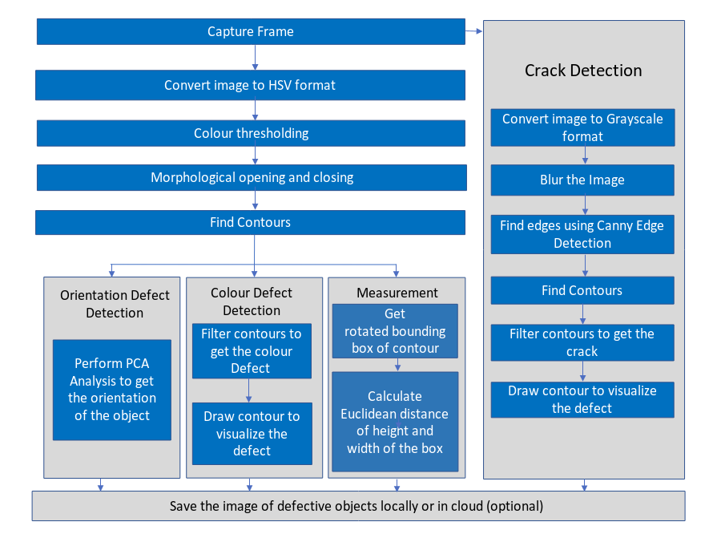

* **Orientation defect detection**: Obtain the frame and change the color space to HSV format. Threshold the image based on the color of the object using [inRange](https://docs.opencv.org/3.4.0/da/d97/tutorial_threshold_inRange.html) function to create a mask. Perform morphological opening and closing on the mask and find the contours using [findContours](https://docs.opencv.org/3.4.0/d4/d73/tutorial_py_contours_begin.html) function. Filter the contours based on the area. Perform [PCA](https://docs.opencv.org/3.4/d1/dee/tutorial_introduction_to_pca.html) on the contours to get the orientation of the object.

  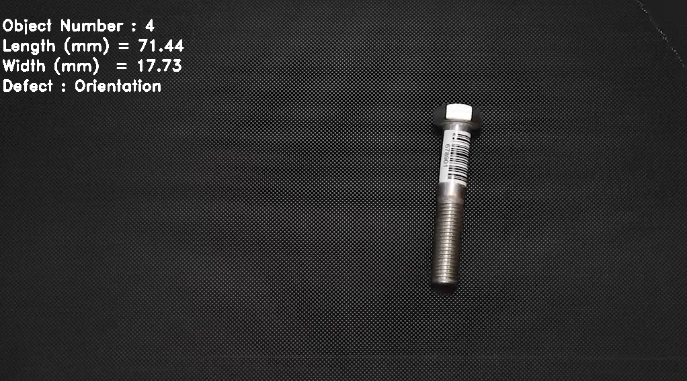

* **Color defect detection**: Threshold the image based on the defective color of the object using [inRange](https://docs.opencv.org/3.4.0/da/d97/tutorial_threshold_inRange.html) function. Use the mask obtained from the [inRange](https://docs.opencv.org/3.4.0/da/d97/tutorial_threshold_inRange.html) function to find the defective area.

  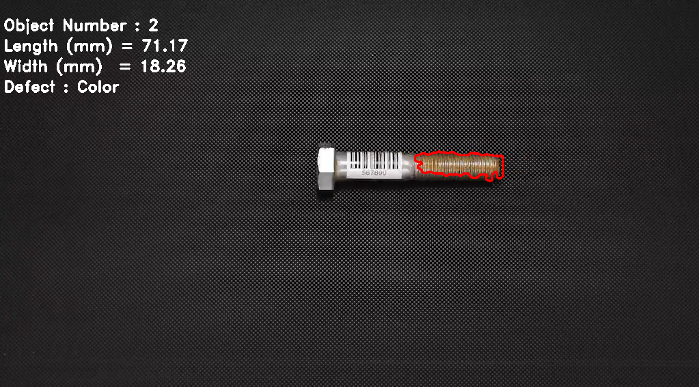

* **Crack detection**: Transform the image from BGR to Grayscale format using [cvtColor](https://docs.opencv.org/3.4.3/d7/d1b/group__imgproc__misc.html#ga397ae87e1288a81d2363b61574eb8cab) function. Blur the image using [blur](https://docs.opencv.org/3.4.0/dc/dd3/tutorial_gausian_median_blur_bilateral_filter.html) function to remove the noises. Use the contours found on the blurred image to detect the cracks.

  

* Save the images of defective objects in their respective folders. For example, objects with color defect are saved in **color** folder, objects containing cracks are saved in **crack** folder, objects with orientation defect are saved in **orientation** folder and objects with no defect are stored in **no_defect** folder.

## Install Intel® System Studio 2019

1. Download [Intel® System Studio 2019](https://software.intel.com/en-us/system-studio/choose-download) and extract the downloaded zip file.
2. Open a new terminal and navigate to the directory where the contents are extracted in the previous step.
3. Run ./install.sh script and follow the instructions provided there to install Intel® System Studio 2019.

### Run the Application on Intel® System Studio 2019

On the system, open Intel® System Studio 2019 and choose your workspace.
1. Click **File -&gt; New -&gt; Project -&gt; Intel Application Development**.
2. Select **C++ project**. Click **Next**.

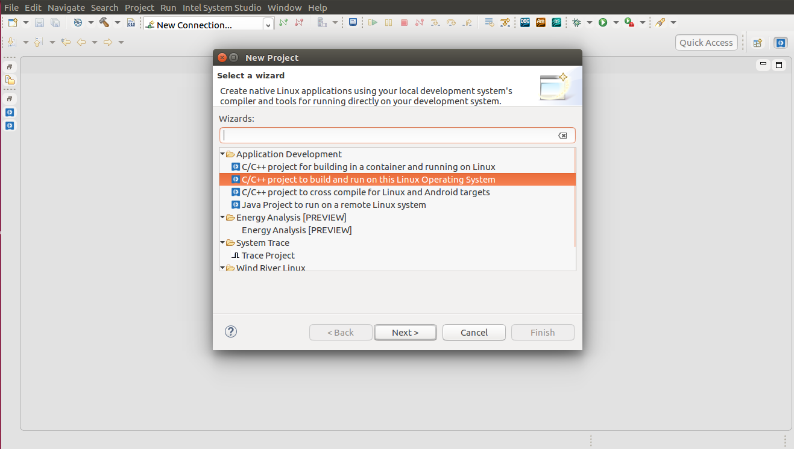

3. Select **Tool Samples** tab and click on  **Intel® C++ Complier -&gt; Hello World** example and change the name of the project to **object-flaw-detector**. Click **Next**.

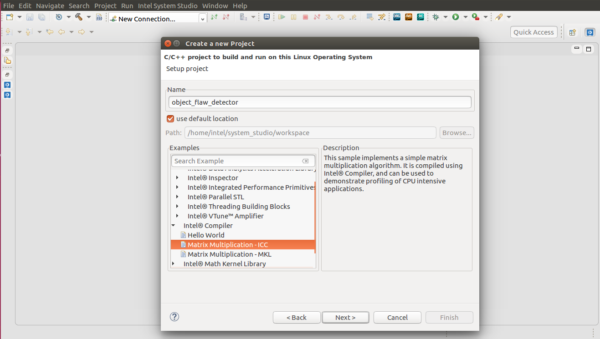

4. Select Complier for the project as **GNU Compiler Collection* (GCC)**. Click **Finish**.

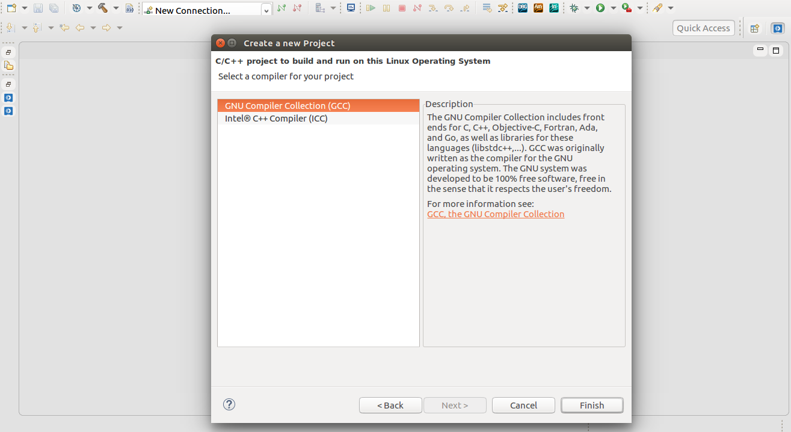

5. Delete the file named **hello_world.cpp** (example code) from the Project Explorer.
6. Click **File -&gt; New -&gt; File**. Select the parent folder and name the new file as **product-flaw-detector.cpp**. Click **Finish**.
7. Copy the code from **product-flaw-detector.cpp** of this repository to the newly created file.


### Add Include Path
1. Select **Project -> Properties -> C/C++ General -> Paths and Symbols**.
2. Select **Includes -> GNU C++** and Click on **Add...**
3. Click on **File system...** and add *opt/intel/openvino/opencv/include* and *<path_to_object-flaw-detector_directory>* to include the path of OpenVINO™ toolkit. Click **Apply and Close**.

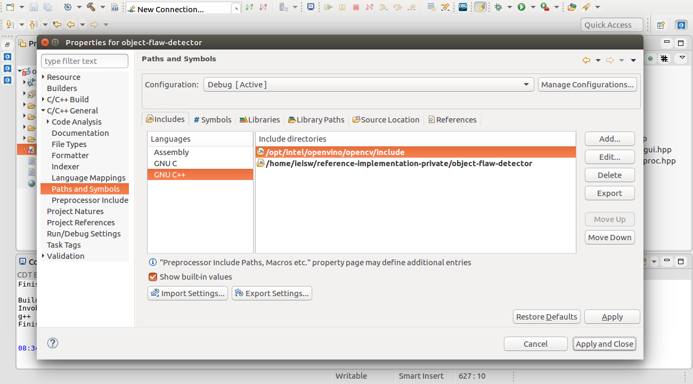


### Add Libraries  
1. Select **Project -&gt; Properties -&gt; C/C++ Build -&gt; Settings -&gt; GCC C++ Linker -&gt; Libraries.**
2. Click on **File system...** and add *opt/intel/openvino/opencv/lib* to ```Library Search Path (-L)```.
3. Add **opencv_core, opencv_highgui, opencv_imgproc, opencv_imgcodecs, opencv_videoio** to the ```Libraries (-l)``` and click **Apply and Close**.

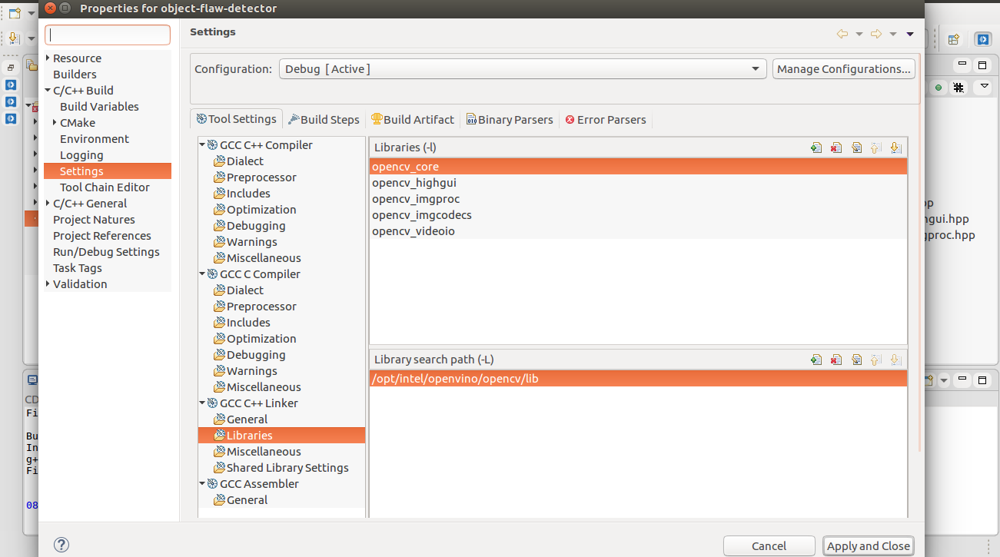

Select **Project -&gt; Properties -&gt; C/C++ Build -&gt; Settings -&gt; GCC C++ Compiler -&gt; Dialect**.
Select the Language standard as ISO **C++ 11(-std=c++0x)** and click **Apply and Close**.

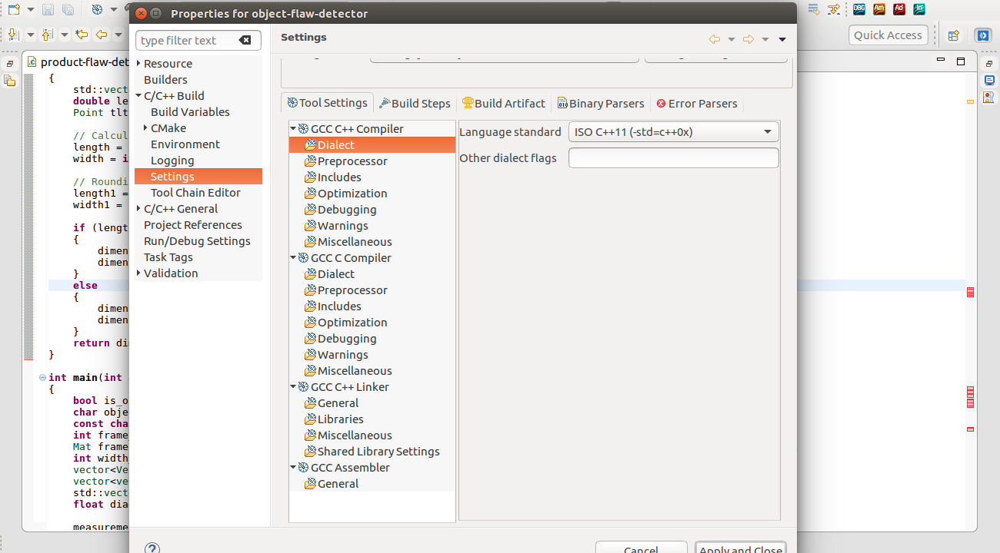

### Build the Project 
1. Select **Project -&gt; Build Project**.

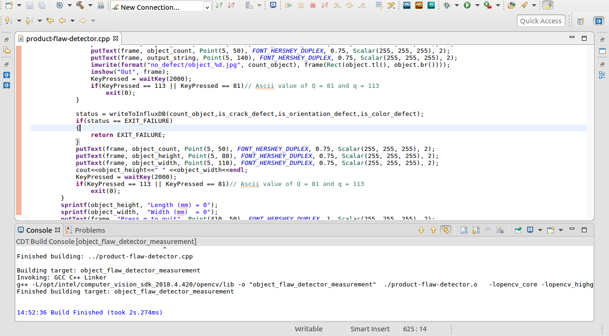

### Run the Project
1. Select **Run -&gt; Run Configuration.. -&gt; C/C++ Application -&gt;**. Choose the project **object-flaw-detector**.
2. Click on **Arguments** and specify the path of the video under **Program Arguments** followed by -i.
3. Click **Run**.

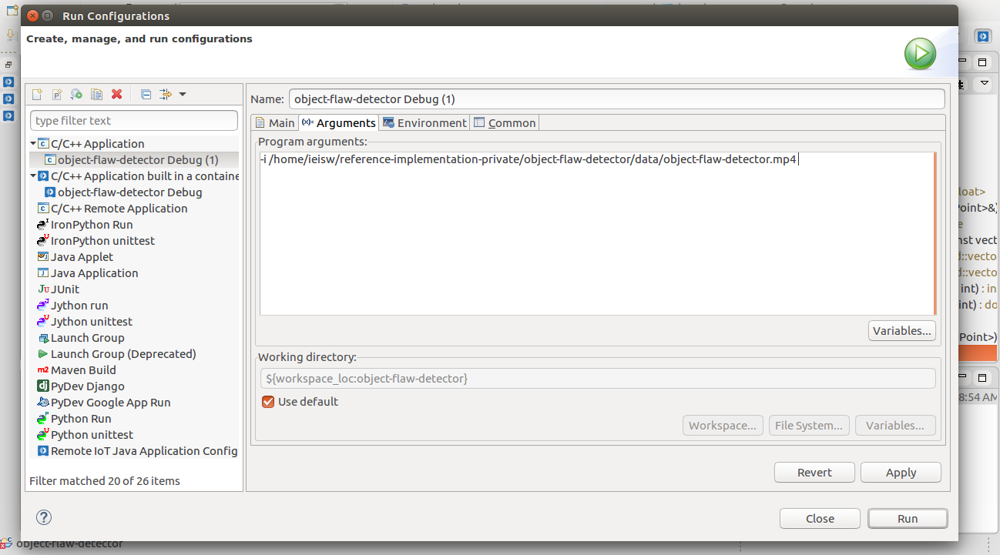

**Optional**- If field of view and distance between the object and camera are available, use -f and -d arguments respectively. Otherwise camera of 96 pixels per inch is considered by default. 

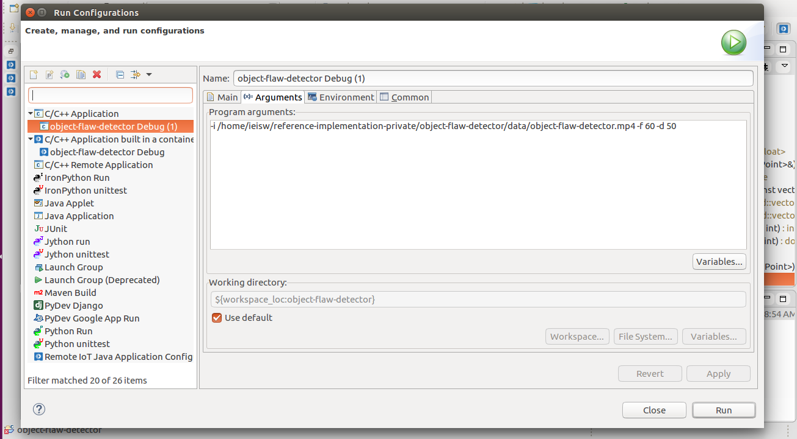

4. To run the program using camera as input, replace the video path in step 2 with cam. 

**Note**- If you are running the application on **Intel® System Studio**, the defect images are stored in the <object-flaw-detector> directory in **Intel® System Studio** workspace.

## Troubleshooting

If this error occurs while running the code on Intel® System Studio:
**error while loading shared libraries: libopencv_core.so.4.1: cannot open shared object file: No such file or directory**

Execute these steps:

* Create a file opencv.conf in /etc/ld.so.conf.d/.
* Write the path of the particular library in the opencv.conf file.
* Run sudo ldconfig -v.

## Run the Application from the Terminal

* Open a terminal on Ubuntu.

* Updates to several environment variables are required to compile and run Intel® Distribution of OpenVINO™ toolkit applications. Run the following script on the terminal to temporarily set the environment variables.

   ``` 
   source /opt/intel/openvino/bin/setupvars.sh 
   ```

* Go to `object-flaw-detector` directory.
	
   ``` 
   cd <path-to-object-flaw-detector> 
   ```

* Create a directory **build**.

   ``` 
   mkdir build 
   ```

* Build the project.
		
   ``` 
   cd build
   cmake .. 
   make 
   ```

* Run the application.

   ``` 
   ./product-flaw-detector -i ../data/object-flaw-detector.mp4 
   ```

  **Note:** To get the input video from the camera, use the following command:
   ``` 
   ./product-flaw-detector -i cam 
   ```
  **Optional:** If field of view and distance between the object and camera are available, use -f and -d command line arguments respectively. Otherwise a camera of 96 pixels per inch is considered by default. For example:

    ``` 
    ./product-flaw-detector -i ../data/object-flaw-detector.mp4  -f 60 -d 50
    ```

  **Note:** User can get field of view from camera specifications. The values for -f and -d should be in **degrees** and **millimeters** respectively.

* To check the data on InfluxDB, run the following commands.

    ```
    influx
    show databases
    use Defect
    select * from Defect
    ```

*  To visualize data on Grafana, follow below steps.

1. On the terminal, run the given  command.

    ```
    sudo service grafana-server start
    ```

2. In your browser, go to localhost:3000.

3. Log in with user as **admin** and password as **admin**.

4. Click on the **Configuration**  on left side of the panel.

5. Select **“Data Sources”**.

6. Click on **“+ Add data source”** and provide below inputs
     * *Name*: Defect.
     * *Type*: InfluxDB.
     * *URL*: http://localhost:8086.
     * *Database*: Defect.
     * Click on “Save and Test”.

       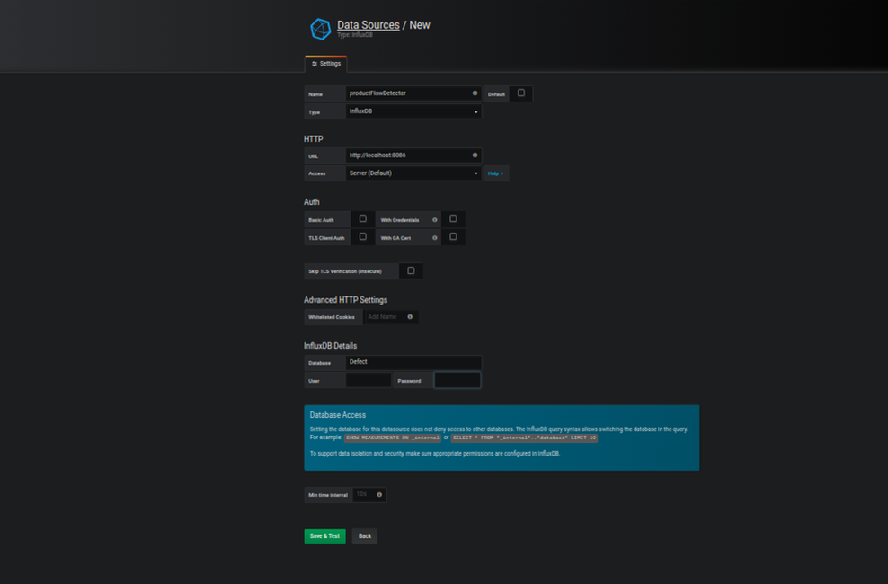

7. To add graph to the created Dashboard, follow the below steps
     * Click on Add(**+**) on left side of panel. 
     * Select **“Dashboard”**.
     * Select **“Graph”**. Click on **Panel Title**, select **Edit** and then select **Metrics** tab.
     * On the **Metrics** tab
        1. From **Datasource** choose **Defect**.
        2. Click on the row just below the tab, starting with **“A”**.
        3. Click on **“select measurement”** and select **“Defect”**.
        4. From **SELECT** row, click on **“fields”** and select **“objectNumber”**. Also click on **+** in the same row, select   **Aggregations** and click on **distinct()**. Again click on **+** in the same row, select **Aliasing** and click on **alias** to provide alias for the respective field. From **GROUP BY** row, click on time and select **1s** also click on fill and select **null**. Name the query as **objectNumber** in the **ALIAS BY** row.
        5. Similarly, do it for **“crackDefect”**, **“orientationDefect”** and **“colorDefect”** by clicking **Add Query**.

     * On the **Time range** tab, change the **override relative time** to 100s.
     * Save the dashboard by clicking on top panel with name **productFlawDetector**.


       

8. To add table to the created Dashboard, follow the below steps
     * Click on the **add panel** icon on the top menu.
     * Select **Table**, click on **Panel Title**, select **Edit** and then select **Metrics** tab. Follow the steps mentioned in the previous step for configuring **Metrics** and **Time range** tab except for **Aggregations** and select **none** in fill.
     * Select **Selectors** and click on **last**  from select row.
     * From the **Column Styles** tab, click on **+Add** in the **Apply to columns named** give the name **objectNumber**, and change the value to **0** in the **Decimals** under **Type** option.
     * In the same row click on **+Add** and select other fields (**“crackDefect”**, **“orientationDefect”** and **“colorDefect”**).
     * Save the dashboard and click on **Back to dashboard** icon which is on right corner of the top menu.
       
  
9.  To add gauge to the created Dashboard, follow the below steps
     * Click on the **add panel** icon on the top menu. 
     * Select **Singlestat**. Click on **Panel Title**, select **Edit** and then select **Metrics** tab menu and follow the steps mentioned in the previous steps for configuring **Metrics** tab except for aggregations and fill.
     * Select **Selectors** and click on **last**  from select row. Do the following only for **objectNumber**.Name the query as **objectNumber** in the   **ALIAS BY** row. 
     * On the **Options** tab, select **show** under **Gauge** option  and change the value of **decimals** to **0** under **Value** option.
     * Save the dashboard and click on **Back to dashboard** icon.
       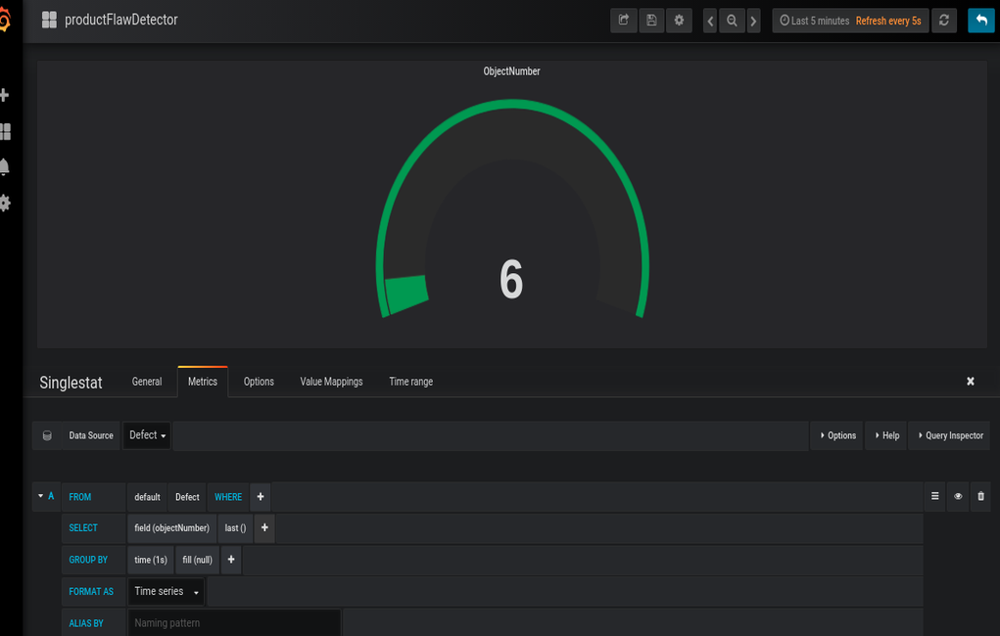

10. Mark the current directory as favorite by clicking on **Mark as favorite** icon on the top menu.

11. Select **Time picker** from the top menu of dashboard. Under **Custom range** change the **From** value to **now-10s** and **Refreshing every:** to **5s**.

12. For re-testing, follow the below steps 
     * In a new browser tab or window, go to http://localhost:3000/.
     * Log in with user as **admin** and password as **admin**.
     * The **“New dashboard”** will now show up in the list of starred dashboards (and probably also under “Recently viewed dashboards”).
     * Click on “New dashboard” to see the chart.

         

     * Run the C++ code again to visualize data on grafana.

        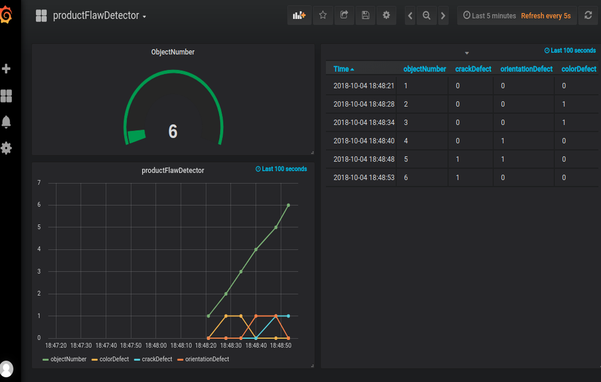

        ​                                                           

* Alternatively, visualization on Grafana can be done by following below steps

   1. In your browser, go to localhost:3000.
   2. Log in with user as **admin** and password as **admin**.
   3. Click on **Configuration**.
   4. Select **“Data Sources”**.
   5. Click on **“+ Add data source”** and provide below inputs.
     * *Name*: Defect
     * *Type*: InfluxDB
     * *URL*: http://localhost:8086
     * *Database*: Defect
     * Click on “Save and Test”

       

   6. Click on **+**  icon present on the left side of the browser, select **import**.
   7. Click on **Upload.json File**.
   8. Select the file name "productFlawDetector.json" from object-flaw-detector directory.
   9. Select "Defect" in **Select a influxDB data source**.
  10. Click on import.
  11. Run the application to see the data on the dashboard.

## (Optional) Save Data to the Cloud
As an optional step, send data results to an Amazon Web Services (AWS)*  instance for graphing.

1\. Make an EC2 Linux* instance on AWS
([*https://docs.aws.amazon.com/AWSEC2/latest/UserGuide/EC2\_GetStarted.html*](https://docs.aws.amazon.com/AWSEC2/latest/UserGuide/EC2_GetStarted.html))

2\. Install InfluxDB on EC2 Linux instance
([*https://github.com/influxdata/influxdb*](https://github.com/influxdata/influxdb))

3\. Install Grafana on EC2 Linux instance
([*https://grafana.com/get*](https://grafana.com/get))

